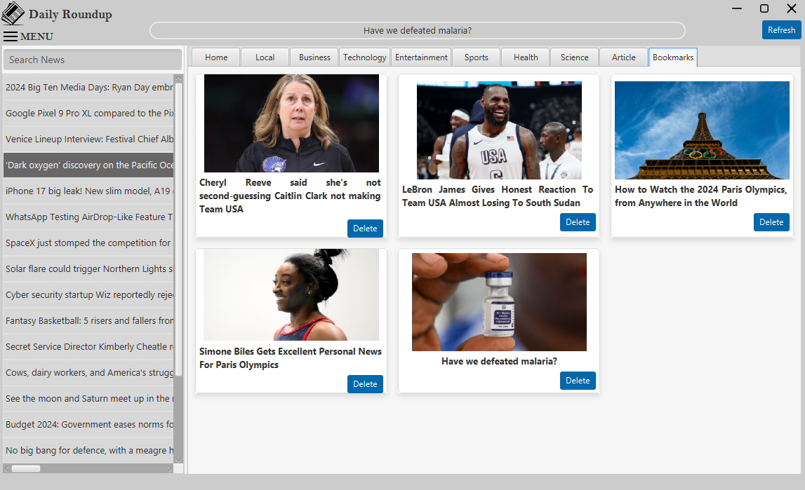

# Daily Roundup - News App

A JavaFX application that aggregates news from various sources and displays them in a user-friendly interface.

## Features

- Browse news articles from different categories (Business, Technology, Entertainment, Sports, Health, Science)
- Search for news articles by keywords
- Bookmark favorite articles for later reading
- Set personal news preferences to customize your feed
- Browse local news
- Light and dark theme support
- Built-in web browser for reading articles

## Screenshots

    
    
    
    

## Getting Started

### Prerequisites

- Java JDK 11 or higher
- JavaFX 11 or higher

### Running the Application

1. Clone the repository
2. Build the project with your preferred Java IDE or build tool
3. Run the application

## How to Use

- Click on any news article to read it in the built-in browser
- Use the search bar to find specific news
- Save your favorite articles by clicking the star icon
- Create keyword preferences to customize your news feed
- Switch between light and dark theme as needed

## Technologies Used

- Java
- JavaFX
- NewsAPI

## License

[[LICENSE](LICENSE)]
